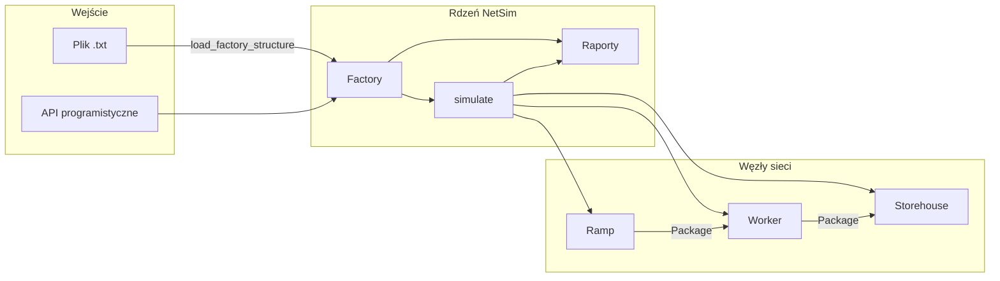

# NetSim

**Symulator dyskretnej sieci produkcyjnej** — projekt zespołowy zrealizowany w ramach zajęć z *Programowania Obiektowego* na **AGH University of Science and Technology**.

NetSim modeluje przepływ półproduktów (`Package`) przez wielowarstwową sieć logistyczną fabryki: rampy załadunkowe dostarczają towar, robotnicy przetwarzają go w kolejkach FIFO/LIFO, a magazyny gromadzą gotowy produkt. Całość jest sterowana dyskretnym zegarem symulacji, z walidacją spójności topologii, probabilistycznym routingiem paczek oraz systemem raportowania stanu.

> Projekt obejmuje kilka tysięcy linii logiki rozłożonej na moduły, dziesiątki testów jednostkowych (GoogleTest / GoogleMock) oraz zaawansowane mechanizmy C++17: semantykę przenoszenia, `std::optional`, szablony, polimorfizm interfejsów i wstrzykiwanie generatora losowego.

---

## Spis treści

- [Autorzy](#autorzy)
- [Opis problemu](#opis-problemu)
- [Architektura](#architektura)
- [Moduły projektu](#moduły-projektu)
- [Model symulacji](#model-symulacji)
- [Format pliku fabryki](#format-pliku-fabryki)
- [Wymagania](#wymagania)
- [Budowanie i uruchamianie](#budowanie-i-uruchamianie)
- [Testy](#testy)
- [Konfiguracja ćwiczenia](#konfiguracja-ćwiczenia)
- [Struktura katalogów](#struktura-katalogów)
- [Materiały](#materiały)

---

## Autorzy

Projekt został opracowany **zespołowo** — każdy moduł odpowiada za odrębny fragment architektury:

| Autor | Zakres odpowiedzialności |
|-------|--------------------------|
| **Aleksander Młynarski** ([alekm](mailto:alek.mlynarski05@gmail.com)) | Węzły sieci (`Ramp`, `Worker`, `Storehouse`), `ReceiverPreferences`, `PackageSender`, moduł `helpers`, mocki testowe |
| **Mateusz Łaś** ([mateuszl](mailto:mateuszlas8@gmail.com)) | Klasa `Factory`, kolekcja węzłów (`NodeCollection`), walidacja spójności sieci (DFS), operacje symulacyjne fabryki |
| **Miłosz** | Silnik symulacji (`simulate`), integracja callbacków raportowania |
| **Maciej Maciejewski** ([poporosu](mailto:maciejewski1234556@gmail.com)) | Parsowanie i serializacja struktury fabryki, generowanie raportów (`reports`) |

*Kurs: Programowanie obiektowe · AGH · 2025/2026*

---

## Opis problemu

Celem projektu jest zbudowanie **obiektowego symulatora fabryki**, w którym:

1. Użytkownik definiuje topologię sieci (rampy → robotnicy → magazyny) w pliku tekstowym lub programowo.
2. System weryfikuje, czy **każda ścieżka prowadzi do magazynu** (spójność sieci).
3. Symulacja przebiega w **turach** — w każdej turze wykonywane są dostawy, przekazywanie paczek i przetwarzanie.
4. Routing paczek odbywa się **probabilistycznie** — nadawca wybiera odbiorcę wg znormalizowanych preferencji.
5. Generowane są **raporty strukturalne** (topologia) i **raporty tur** (stan buforów, kolejek, magazynu).

Projekt wymaga głębokiego zrozumienia: RAII, reguł pięciu (Rule of Five), iteratorów, szablonów, polimorfizmu dynamicznego oraz testowania z mockami.

---

## Architektura



### Hierarchia klas (uproszczona)

```
IPackageStockpile ──► IPackageQueue ──► PackageQueue (FIFO / LIFO)
IPackageReceiver  ──► Storehouse, Worker
PackageSender     ──► Ramp, Worker (dziedziczenie wielokrotne)
ReceiverPreferences  — probabilistyczny wybór odbiorcy
Package              — globalne zarządzanie unikalnymi ID
Factory              — graf sieci + walidacja + orkiestracja tur
```

---

## Moduły projektu

### `Package` — identyfikacja półproduktów

- Globalna pula ID z **reuse** po zniszczeniu obiektu (`assigned_IDs` / `freed_IDs`).
- Poprawna semantyka **move** (konstruktor i operator przypisania) bez podwójnego zwalniania identyfikatorów.

### `storage_types` — kolejki magazynowe

- Abstrakcyjne interfejsy `IPackageStockpile` i `IPackageQueue`.
- Implementacja `PackageQueue` z trybami **FIFO** i **LIFO**.

### `nodes` — węzły sieci

| Klasa | Rola |
|-------|------|
| `Ramp` | Dostarcza nowe paczki co *N* tur (`delivery-interval`) |
| `Worker` | Kolejka wejściowa, bufor przetwarzania (PBuffer), bufor wysyłki (SBuffer) |
| `Storehouse` | Końcowy magazyn (stockpile) |
| `ReceiverPreferences` | Mapa odbiorców z prawdopodobieństwami; automatyczne skalowanie przy add/remove |
| `PackageSender` | Bufor wysyłki + wybór odbiorcy i `send_package()` |

### `factory` — zarządzanie siecią

- `NodeCollection<T>` — szablonowa kolekcja na `std::list` (stabilność wskaźników przy modyfikacji).
- `is_consistent()` — **przeszukiwanie DFS** z kolorowaniem węzłów (`UNVISITED` / `VISITED` / `VERIFIED`); każdy nadawca musi mieć osiągalny magazyn.
- `remove_worker` / `remove_storehouse` — kaskadowe usuwanie odbiorcy ze wszystkich preferencji w sieci.

### `simulation` — silnik tur

Każda tura `t = 1 … d`:

1. **`do_deliveries(t)`** — rampy generują paczki
2. **`do_package_passing()`** — rampy i robotnicy wysyłają z buforów
3. **`do_work(t)`** — robotnicy przetwarzają paczki
4. **Callback raportowania** (opcjonalny)

### `reports` — I/O i raporty

- `load_factory_structure` / `save_factory_structure` — parser linii poleceń z komentarzami (`;`).
- `generate_structure_report` — raport topologii sieci.
- `generate_simulation_turn_report` — snapshot stanu w danej turze.
- `IntervalReportNotifier` / `SpecificTurnsReportNotifier` — strategie wyzwalania raportów.

### `helpers` — losowość

- Generator Mersenne Twister (`std::mt19937`) + `std::generate_canonical`.
- Wstrzykiwalny `ProbabilityGenerator` — podmieniany mockiem w testach (GoogleMock).

---

## Model symulacji

```
Tura t:
  ┌─────────────────────────────────────────────────────────┐
  │ 1. Dostawy      Ramp.deliver_goods(t)  → nowe Package   │
  │ 2. Wysyłka      Ramp/Worker.send_package() → routing    │
  │ 3. Praca        Worker.do_work(t)      → przetwarzanie  │
  │ 4. Raport       callback(f, t)         → opcjonalnie    │
  └─────────────────────────────────────────────────────────┘
```

**Dostawa na rampie:** paczka pojawia się, gdy `(t - 1) % delivery_interval == 0`.

**Przetwarzanie u robotnika:** paczka z kolejki trafia do PBuffer; po `processing_time` tur ląduje w SBuffer i może zostać wysłana dalej.

**Routing:** `ReceiverPreferences::choose_receiver()` losuje odbiorcę z rozkładu prawdopodobieństwa (suma = 1.0).

---

## Format pliku fabryki

Przykładowa definicja sieci `R → W → S`:

```text
; == LOADING RAMPS ==

LOADING_RAMP id=1 delivery-interval=10

; == WORKERS ==

WORKER id=1 processing-time=2 queue-type=FIFO

; == STOREHOUSES ==

STOREHOUSE id=1

; == LINKS ==

LINK src=ramp-1 dest=worker-1
LINK src=worker-1 dest=store-1
```

- Linie puste i zaczynające się od `;` są ignorowane.
- `dest` przyjmuje prefiksy `worker-` lub `store-`.
- Każdy kolejny `LINK` przeskalowuje prawdopodobieństwa odbiorców.

---

## Wymagania

| Narzędzie | Wersja |
|-----------|--------|
| **CMake** | ≥ 3.13 |
| **Kompilator C++** | C++17 (GCC 8+, Clang 7+, MSVC 2017+) |
| **GoogleTest** | pobierany automatycznie przez CMake `FetchContent` |

> **Windows:** starszy MinGW (np. GCC 6.3) **nie obsługuje** C++17. Zalecane: **WSL2**, MSYS2/MinGW-w64 (GCC 11+) lub Visual Studio 2019+.

---

## Budowanie i uruchamianie

```bash
git clone <repo-url>
cd NetSim
mkdir build && cd build
cmake ..
cmake --build .
```

### Program główny

```bash
./NetSim          # Linux / WSL / macOS
.\NetSim.exe      # Windows
```

`main.cpp` uruchamia przykładową symulację 10 tur z raportami co 2 tury (`IntervalReportNotifier`).

### Wczytanie własnej fabryki (API)

```cpp
#include <fstream>
#include "reports.hxx"
#include "simulation.hxx"

int main() {
    std::ifstream in("moja_fabryka.txt");
    Factory f = load_factory_structure(in);

    simulate(f, 100, [](Factory& fac, Time t) {
        // własna logika raportowania
    });
}
```

---

## Testy

Projekt zawiera **ponad 30 scenariuszy testowych** w katalogu `tests/`:

| Plik testowy | Zakres |
|--------------|--------|
| `test_package.cpp` | ID, move semantics |
| `test_storage_types.cpp` | FIFO / LIFO |
| `test_nodes.cpp` | bufor robotnika, dostawy, preferencje, mocki |
| `test_Factory.cpp` | spójność sieci, usuwanie odbiorców |
| `test_factory_io.cpp` | parser, serializacja, round-trip |
| `test_reports.cpp` | format raportów strukturalnych i tur |
| `test_simulate.cpp` | integracja end-to-end |

```bash
cd build
ctest --output-on-failure

# lub bezpośrednio:
./NetSimTests
./NetSimTests --gtest_filter=FactoryTest.*
```

---

## Konfiguracja ćwiczenia

Plik `include/config.hxx` steruje etapem rozwoju projektu (ćwiczenia AGH):

```cpp
#define EXERCISE_ID_PACKAGES    1
#define EXERCISE_ID_NODES       2
#define EXERCISE_ID_FACTORY     3
#define REPORTING               4
#define SIMULATION              5

#define EXERCISE_ID EXERCISE_ID_FACTORY  // aktualny etap
```

Wyższy `EXERCISE_ID` włącza kolejne makra (`WITH_PROBABILITY_GENERATOR`, `WITH_RECEIVER_TYPE`) i rozszerza interfejsy klas.

---

## Struktura katalogów

```
NetSim/
├── CMakeLists.txt          # build system + FetchContent (gtest)
├── main.cpp                # punkt wejścia — przykładowa symulacja
├── include/                # nagłówki (.hxx)
│   ├── config.hxx          # etap ćwiczenia
│   ├── types.hxx           # aliasy typów (Time, ElementID, …)
│   ├── package.hxx
│   ├── storage_types.hxx
│   ├── nodes.hxx
│   ├── factory.hxx
│   ├── simulation.hxx
│   ├── reports.hxx
│   └── helpers.hxx
├── src/                    # implementacje (.cpp)
├── tests/                  # testy GoogleTest / GoogleMock
└── mocks/                  # mocki do testów węzłów i generatora losowego
```

---

## Materiały

Dokumentacja projektu (AGH):

- [Net Simulation — węzły sieci](http://home.agh.edu.pl/~mdig/dokuwiki/doku.php?id=teaching:programming:soft-dev:topics:net-simulation:part_nodes)
- [Google Mock — drukowanie własnych typów w testach](https://github.com/google/googlemock/blob/master/googlemock/docs/v1_5/CookBook.md#teaching-google-mock-how-to-print-your-values)

---

## Licencja

Projekt akademicki — AGH, 2025/2026. Kod przeznaczony do celów edukacyjnych w ramach zajęć programowania obiektowego.
