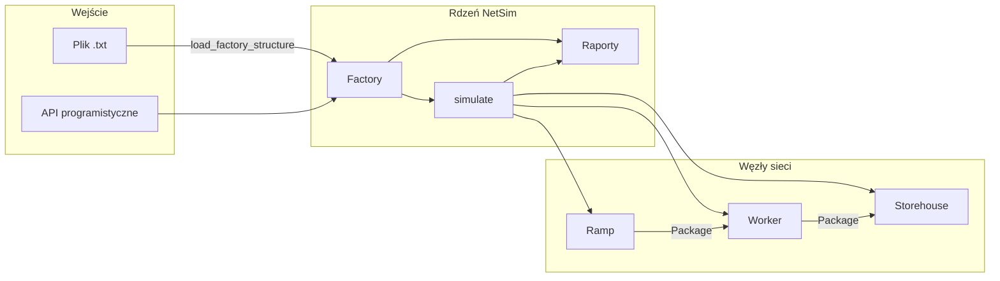

# NetSim

**Symulator dyskretnej sieci produkcyjnej** — projekt zespołowy zrealizowany w ramach zajęć z *Programowania Obiektowego* na **AGH University of Science and Technology**.

NetSim modeluje przepływ półproduktów (`Package`) przez wielowarstwową sieć logistyczną fabryki: rampy załadunkowe dostarczają towar, robotnicy przetwarzają go w kolejkach FIFO/LIFO, a magazyny gromadzą gotowy produkt. Symulacja przebiega w dyskretnych turach, z walidacją spójności topologii, probabilistycznym routingiem paczek oraz generowaniem raportów stanu.

---

## Spis treści

- [Autorzy](#autorzy)
- [Wymagania](#wymagania)
- [Szybki start](#szybki-start)
- [Budowanie i uruchamianie](#budowanie-i-uruchamianie)
- [Testy](#testy)
- [Konfiguracja](#konfiguracja)
- [Architektura](#architektura)
- [Moduły projektu](#moduły-projektu)
- [Model symulacji](#model-symulacji)
- [Format pliku fabryki](#format-pliku-fabryki)
- [Struktura katalogów](#struktura-katalogów)
- [Materiały](#materiały)
- [Licencja](#licencja)

---

## Autorzy

- Aleksander Młynarski
- Mateusz Łaś
- Maciej Maciejewski

*Kurs: Programowanie obiektowe · AGH · 2025/2026*

---

## Wymagania

**Docker (zalecane)**

- [Docker Desktop](https://www.docker.com/products/docker-desktop/) 4.x+ lub Docker Engine z Compose v2

**Lokalnie (alternatywa)**

| Narzędzie | Wersja |
|-----------|--------|
| CMake | ≥ 3.13 |
| Kompilator C++ | C++17 (GCC 8+, Clang 7+, MSVC 2019+) |
| GoogleTest | pobierany automatycznie przez CMake `FetchContent` |

---

## Szybki start

```bash
git clone <repo-url>
cd NetSim
docker compose build
docker compose run --rm test
docker compose run --rm run
```

| Komenda | Opis |
|---------|------|
| `docker compose build` | Kompilacja projektu w kontenerze |
| `docker compose run --rm test` | Uruchomienie zestawu testów (`NetSimTests`) |
| `docker compose run --rm run` | Uruchomienie symulacji (`NetSim`) |

---

## Budowanie i uruchamianie

### Docker

```bash
docker compose build
docker compose run --rm run
```

### Lokalnie

```bash
mkdir build && cd build
cmake ..
cmake --build .
```

Po kompilacji pliki wykonywalne znajdują się w katalogu `build/`:

| Platforma | Program | Testy |
|-----------|---------|-------|
| Linux / WSL / macOS | `./NetSim` | `./NetSimTests` |
| Windows | `NetSim.exe` | `NetSimTests.exe` |

Katalog `build/` oraz binaria nie są śledzone w repozytorium — generowane są wyłącznie w procesie kompilacji.

### Punkt wejścia

Program `main.cpp` wczytuje definicję fabryki z pliku `examples/factory.txt` i uruchamia symulację z raportowaniem okresowym. Parametry uruchomienia (liczba tur, interwał raportów, ścieżka do pliku) konfiguruje się w `main.cpp`.

---

## Testy

Projekt zawiera 32 scenariusze testowe w katalogu `tests/`, uruchamiane przez jeden plik wykonywalny `NetSimTests`.

**Docker**

```bash
docker compose run --rm test
docker compose run --rm test ./NetSimTests --gtest_filter=FactoryTest.*
```

**Lokalnie**

```bash
cd build
ctest --output-on-failure
./NetSimTests
./NetSimTests --gtest_filter=FactoryTest.*
```

| Plik testowy | Zakres |
|--------------|--------|
| `test_package.cpp` | Przydzielanie ID, semantyka move |
| `test_storage_types.cpp` | Kolejki FIFO / LIFO |
| `test_nodes.cpp` | Buforowanie, dostawy, preferencje odbiorców, mocki |
| `test_Factory.cpp` | Spójność sieci, usuwanie odbiorców |
| `test_factory_io.cpp` | Parser i serializacja struktury fabryki |
| `test_reports.cpp` | Raporty strukturalne i tur |
| `test_simulate.cpp` | Symulacja end-to-end |

Oczekiwany wynik: `[  PASSED  ] 32 tests.`

---

## Konfiguracja

Projekt nie korzysta ze zmiennych środowiskowych. Konfiguracja odbywa się przez pliki źródłowe:

| Cel | Plik | Parametry |
|-----|------|-----------|
| Parametry symulacji | `main.cpp` | `simulation_turns`, `report_every_n_turns`, `factory_file` |
| Topologia fabryki | `examples/factory.txt` | rampy, robotnicy, magazyny, linki |
| Etap ćwiczenia (kompilacja) | `include/config.hxx` | makro `EXERCISE_ID` |

**`main.cpp`**

```cpp
const char* factory_file = "examples/factory.txt";
const TimeOffset simulation_turns = 10;
const TimeOffset report_every_n_turns = 2;
```

**`examples/factory.txt`** — parametry węzłów:

| Parametr | Opis |
|----------|------|
| `delivery-interval` | Interwał dostaw paczek na rampie (w turach) |
| `processing-time` | Czas przetwarzania paczki przez robotnika (w turach) |
| `queue-type` | Typ kolejki robotnika: `FIFO` lub `LIFO` |
| `LINK src=... dest=...` | Połączenie między węzłami sieci |

Zmiana `examples/factory.txt` wymaga jedynie ponownego uruchomienia programu. Zmiana `main.cpp` lub `config.hxx` wymaga przebudowania projektu.

**`include/config.hxx`**

```cpp
#define EXERCISE_ID EXERCISE_ID_FACTORY
```

Makro `EXERCISE_ID` steruje etapem ćwiczenia AGH i włącza kolejne fragmenty interfejsu (`WITH_PROBABILITY_GENERATOR`, `WITH_RECEIVER_TYPE`).

---

## Architektura



### Hierarchia klas

```
IPackageStockpile ──► IPackageQueue ──► PackageQueue (FIFO / LIFO)
IPackageReceiver  ──► Storehouse, Worker
PackageSender     ──► Ramp, Worker
ReceiverPreferences
Package
Factory
```

---

## Moduły projektu

### `Package`

Globalna pula identyfikatorów z mechanizmem reuse (`assigned_IDs` / `freed_IDs`) oraz semantyką move bez podwójnego zwalniania ID.

### `storage_types`

Interfejsy `IPackageStockpile`, `IPackageQueue` oraz implementacja `PackageQueue` (FIFO / LIFO).

### `nodes`

| Klasa | Rola |
|-------|------|
| `Ramp` | Dostarcza paczki co *N* tur |
| `Worker` | Kolejka, bufor przetwarzania (PBuffer), bufor wysyłki (SBuffer) |
| `Storehouse` | Magazyn końcowy |
| `ReceiverPreferences` | Probabilistyczny wybór odbiorcy |
| `PackageSender` | Bufor wysyłki i przekazywanie paczek |

### `factory`

Szablonowa kolekcja `NodeCollection<T>` na `std::list`, walidacja spójności sieci algorytmem DFS oraz operacje orkiestracji tur.

### `simulation`

Silnik dyskretny: dostawy → przekazywanie paczek → przetwarzanie → opcjonalny callback raportowania.

### `reports`

Parser i serializacja struktury fabryki, raporty topologii i stanu tur, notyfikatory raportów.

### `helpers`

Generator pseudolosowy (Mersenne Twister) z możliwością wstrzyknięcia zamiennika w testach.

---

## Model symulacji

Każda tura `t = 1 … d`:

1. `do_deliveries(t)` — rampy generują paczki
2. `do_package_passing()` — przekazywanie paczek między węzłami
3. `do_work(t)` — przetwarzanie przez robotników
4. Callback raportowania (opcjonalnie)

**Dostawa:** `(t - 1) % delivery_interval == 0`

**Przetwarzanie:** paczka przechodzi z kolejki → PBuffer → SBuffer po upływie `processing_time` tur.

**Routing:** `ReceiverPreferences::choose_receiver()` — losowanie wg znormalizowanych prawdopodobieństw.

---

## Format pliku fabryki

```text
; == LOADING RAMPS ==

LOADING_RAMP id=1 delivery-interval=2

; == WORKERS ==

WORKER id=1 processing-time=1 queue-type=FIFO

; == STOREHOUSES ==

STOREHOUSE id=1

; == LINKS ==

LINK src=ramp-1 dest=worker-1
LINK src=worker-1 dest=store-1
```

- Linie puste oraz komentarze (`;`) są ignorowane.
- Prefiksy `dest`: `worker-`, `store-`.
- Kolejne wpisy `LINK` przeskalowują prawdopodobieństwa odbiorców.

Przykład: [`examples/factory.txt`](examples/factory.txt)

---

## Struktura katalogów

```
NetSim/
├── Dockerfile
├── docker-compose.yml
├── CMakeLists.txt
├── main.cpp
├── examples/
│   └── factory.txt
├── include/
├── src/
├── tests/
└── mocks/
```

---

## Materiały

- [Net Simulation — węzły sieci (AGH)](http://home.agh.edu.pl/~mdig/dokuwiki/doku.php?id=teaching:programming:soft-dev:topics:net-simulation:part_nodes)
- [Google Mock — drukowanie własnych typów](https://github.com/google/googlemock/blob/master/googlemock/docs/v1_5/CookBook.md#teaching-google-mock-how-to-print-your-values)

---

## Licencja

Projekt akademicki — AGH, 2025/2026. Kod przeznaczony do celów edukacyjnych w ramach zajęć programowania obiektowego.
